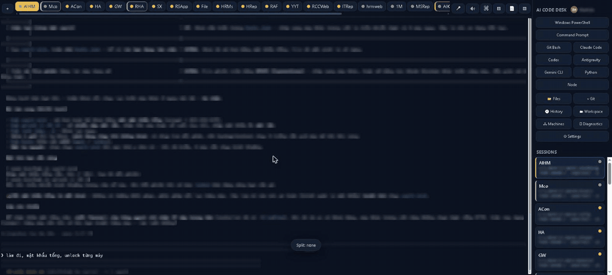
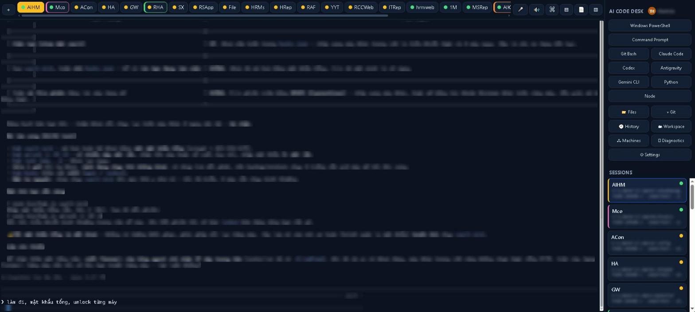
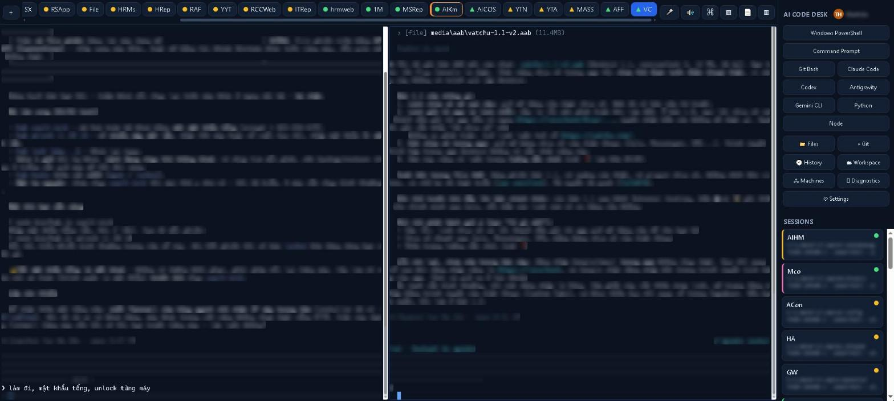
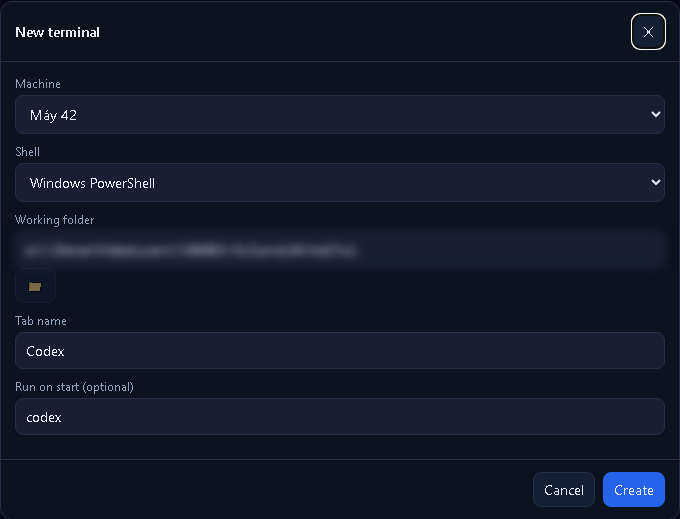
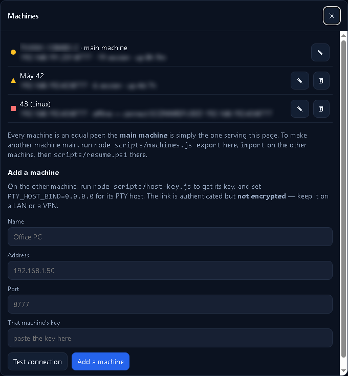
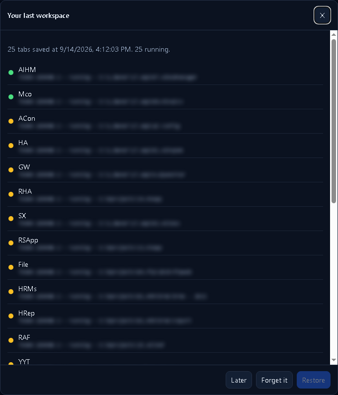
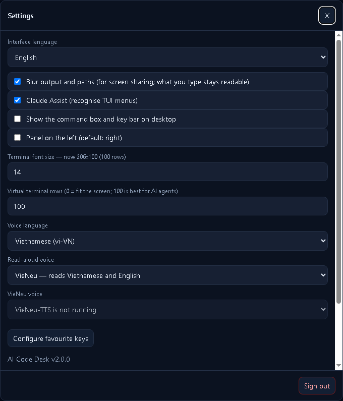
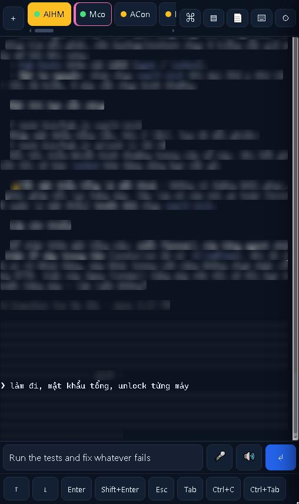
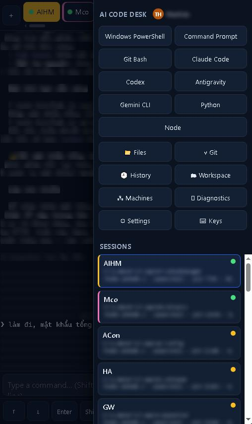

# AI Code Desk

**Run Claude Code, Codex, Antigravity, Gemini CLI — any coding agent — on your own Windows and Linux machines, and steer all of them from one browser tab or from your phone.**

**English** · [Tiếng Việt](README.vi.md)



<sub>A real working day: 25 terminals on two machines. Terminal output is blurred by the app's own presenting mode; what was typed stays readable.</sub>

AI Code Desk is a self-hosted web terminal built for long-running AI coding agents. Every tab is a real
pseudo-terminal (ConPTY on Windows, a POSIX PTY on Linux) owned by a small host process, so the agents'
full-screen interfaces behave exactly as they do in Windows Terminal — and keep running when you close the
browser, lose signal, or restart the web server.

```
 Phone / tablet / PC browser
          │  HTTPS + a single WebSocket
          ▼
   Web server  (server/server.js)     ← restart it whenever you like
          │  TCP + per-machine key
          ▼
   PTY host    (server/pty-host.js)   ← owns every terminal; one per machine
          ├─ PowerShell · pwsh · cmd · Git Bash · bash · zsh
          └─ Claude Code · Codex · Antigravity · Gemini CLI · Python · git · vim …
```

---

## Contents

- [Why](#why) · [What it looks like](#what-it-looks-like) · [Features](#features) · [Supported agents](#supported-agents)
- [Walkthrough: from install to your phone](#walkthrough-from-install-to-your-phone)
- [Why not just Claude Remote Control?](#why-not-just-claude-remote-control)
- [Keeping it running](#keeping-it-running-windows) · [Several machines](#several-machines) · [Configuration](#configuration)
- [Security](#security) · [Development](#development) · [Known limitations](#known-limitations) · [Contributing](#contributing) · [License](#license)

## Why

A coding agent is most useful left running on the machine that has your code, your tools and your
credentials — usually several agents, on several projects, on more than one machine. Walking away from the
desk should not mean walking away from them. The usual ways to keep an eye on them fall short:

- **RDP / SSH apps on a phone** are cramped, and the on-screen keyboard fights every full-screen program.
- **Most web terminals** run commands with `exec()`, or break when a program repaints the screen — which an
  agent's interface does many times a second.
- **Each vendor's remote feature covers its own agent**, one session at a time, through its own service.
- **Phone keyboards compose text through an IME** (Vietnamese Telex, Chinese pinyin, autocorrect …), which a
  terminal that sends one character at a time turns into garbage.

AI Code Desk was built against one real workload — dozens of agent sessions across Windows and Linux
machines, checked and steered from an iPhone — and every design decision below comes from something that
broke in that setting.

## What it looks like

| | |
|---|---|
|  |  |
| **Every project, one screen.** One tab per project; the shape is the machine (● this one, ▲ the other), the colour is the state (green: an agent has worked here, yellow: a shell). Buttons start each installed agent. | **Two machines, side by side.** Split the view: an agent on this machine on the left, one on machine 42 on the right. |
|  |  |
| **Start any agent anywhere.** Pick the machine, the shell, the folder and a command to run — `codex` here. | **Machines are peers.** Each has a name and a shape; the one serving the page is simply "main". |
|  |  |
| **Back after a reboot.** Every tab you had, in the same folders on the same machines, one click away. | **Settings.** Interface language, presenting blur, virtual rows, voice. |
|  |  |
| **On the phone.** A command box that works with any keyboard, a key bar for the keys a phone lacks. | **Every agent one tap away,** from the phone's side menu. |

## Features

### Real terminals that survive

- **node-pty on ConPTY / POSIX PTY**, not `exec()`. If it runs in a terminal, it runs here.
- **Terminals live in a separate PTY host.** Close the tab, lose the network, redeploy the web server: the
  session keeps running, and reconnecting replays its scrollback (512 KB per session, replayed at the width it
  was recorded at, so nothing re-wraps into a mess).
- **Session history.** Reopen any closed terminal in the same shell, in the same folder.
- **Workspace restore.** After a reboot or a power cut, put every tab back — same order, same folders, same
  machines — with one click.

### Made for coding agents

- **One-click launchers** for Claude Code, Codex, Antigravity and Gemini CLI — each shown only on a machine
  where it is installed. Typing the command in any tab works just as well.
- **Virtual rows.** The PTY is given a screen taller than your phone (100 rows by default), so an agent
  redraws a long answer in place instead of reprinting broken copies of it into the scrollback.
- **Readable transcripts** in the project folder (`.claudehis.txt`, `.codexhis.txt`, `.agyhis.txt`,
  `.geminihis.txt`): what you typed, exactly, and what the agent showed — rebuilt by a VT screen emulator that
  records each line just before it is overwritten, rather than by stripping escape codes.
- **Claude Assist.** When an agent asks you to pick an option, real buttons appear. It only sends keys when
  it is certain which option is highlighted; otherwise it hands you arrow/Enter/Esc keys instead of guessing.
- **Compact reader** (📄) that lists a Claude Code session as steps: what you asked, what it ran, what it said.

### Phone first

- A layout designed for a phone, not a shrunken desktop.
- **IME-safe command box.** Telex/VNI, Gboard and the iOS keyboard compose properly; an Enter pressed while the
  IME is composing belongs to the IME. Multi-line messages reach the agent as one message.
- **Touch scrolling with inertia** that works even while the program has captured the mouse.
- **The keyboard opens only when you tap the input box.** Tapping the terminal is for reading. Tap the
  cursor's line (or double-tap) to type straight into the program.
- **The phone does not reshape your desktop's terminals** just by looking at them — only once you type.
- **Voice.** Dictate into the command box; have the last answer read aloud, with the agent's thinking and tool
  calls left out.

### Several machines, one screen

- Add other Windows or Linux machines by address and key; each runs only a PTY host.
- **Every machine is an equal entry in one list.** Export it, import it on another machine, and that machine
  becomes the one serving the UI — same ids, names and saved tabs.

### Everyday comforts

- **Two interface languages**, English and Vietnamese: it follows your browser and can be switched in Settings.
- **Presenting mode** blurs terminal output, paths and your account name, and keeps what you typed readable —
  for screen sharing, streaming and screenshots like the ones above. `?view` opens a window that watches
  without resizing anyone's terminals.
- Tab names follow the working directory, can be pinned, get one of 9 colours, and can be dragged into order.
- Split view, command palette (`Ctrl+K`), `Alt+1..9`, a file explorer inside the folders you allow, a
  read-only git view, a diagnostics panel, and accounts with admin/user roles — each account sees only its
  own terminals.

## Supported agents

| Agent | Command | One-click button | Transcript file | Tab turns green |
|---|---|---|---|---|
| Claude Code | `claude` | always | `.claudehis.txt` | ✓ |
| Codex | `codex` | when `codex` is on PATH | `.codexhis.txt` | ✓ |
| Antigravity | `agy` or `antigravity` | when installed | `.agyhis.txt` | ✓ |
| Gemini CLI | `gemini` | when `gemini` is on PATH | `.geminihis.txt` | ✓ |
| Anything else (aider, opencode, a REPL …) | type it | — | — | stays yellow |

Every agent runs in a real terminal exactly as if you typed its name, so nothing here depends on how the
agent works inside, and a new agent works the day it ships. Claude Code is the one used every day on the
machines this was built on; the others go through the same terminal, launcher and transcript machinery.
Claude Assist was built around Claude Code's prompts; numbered menus and yes/no questions from other agents
are read by the same rules, and anything it is unsure of falls back to the key bar.

**Claude Code extra:** a bare `claude` starts as `claude --remote-control "<tab name>" --name "<tab name>"`,
so Claude's own Remote Control sessions carry your tab names. With any argument, `claude` runs untouched.

---

## Walkthrough: from install to your phone

The goal: agents working on several projects, on more than one machine, and you steering them from your
phone through a temporary address — no port opened on your router, no VPN app, no vendor account.

### 1. Install on the machine where your code lives

Windows, in an **elevated** PowerShell (the installer stores its settings machine-wide):

```powershell
git clone https://github.com/minaico/ai-code-desk.git ai-code-desk
cd ai-code-desk
.\scripts\install.ps1 -Password "choose-a-long-password" -Roots "C:\Users\you\projects"
.\scripts\resume.ps1
```

- `install.ps1` runs `npm install`, builds the UI and stores a **scrypt hash** of the password — never the
  password itself — in `WEB_TERMINAL_PASSWORD_HASH`. `-Roots` is where the file explorer may go (terminals
  can still start anywhere except Windows system folders).
- `resume.ps1` starts the PTY host and the web server **detached**, so closing the window leaves them
  running. It only starts what is not running yet, so it is also how you bring everything back after a reboot.

Linux:

```bash
git clone https://github.com/minaico/ai-code-desk.git ai-code-desk && cd ai-code-desk
npm ci && npm run build
export WEB_TERMINAL_PASSWORD_HASH="$(node scripts/hash-password.js 'choose-a-long-password')"
npm start          # web server on :8080; it starts the PTY host itself
```

Requirements: Node.js 20+ (developed on 24; the test suite needs 22+). `node-pty` ships prebuilt binaries for
Windows and macOS; on Linux it compiles (`sudo apt install -y build-essential python3`). macOS is untested.

> With no password configured the server falls back to **`123123`** and says so loudly. Change it before the
> port is reachable from anywhere you do not trust. For several people, create accounts:
> `node scripts\user.js add alice --admin` prints a temporary password that must be changed at first sign-in.

### 2. Open a tab per project and start the agents

Open `http://<machine-ip>:8080` and sign in. Then, for each project:

1. Press **＋** (or `Ctrl+K`), choose the folder, and put the agent's command in *Run on start* —
   `claude`, `codex`, `agy`, `gemini`. Or click the agent's button in the side panel and `cd` into the project.
2. Name the tab (or let it take the folder's name) and give it a colour.
3. Talk to the agent as usual. The tab's dot turns green once an agent has worked there, and the transcript
   builds up in the project folder.

Your tab list is saved as you go. After a reboot, run `resume.ps1` and press **Workspace → Restore**.

### 3. Add your other machines (optional)

On each other machine, start only the PTY host; it prints the machine's addresses and its key:

```powershell
.\scripts\start-remote-host.ps1 -AllowFirewall -FromSubnet 192.168.1.0/24   # Windows, elevated
```
```bash
./scripts/start-remote-host.sh                                              # Linux
```

Back in the UI: **Machines → Add a machine** — a name, the address, port `8777`, the key. From now on the
*New terminal* dialog has a machine picker, and every keystroke, resize and restart goes to the machine that
owns the terminal. The link between machines is **encrypted with TLS-PSK** keyed by that machine's own
`.data/host.key` — there is no certificate to create or trust, and a wrong key fails the TLS handshake. Keep
it on a LAN or a VPN anyway (WireGuard, Tailscale, ZeroTier …).

### 4. Reach it from your phone with a temporary address

On the machine serving the UI, with [`cloudflared`](https://developers.cloudflare.com/cloudflare-one/connections/connect-networks/downloads/)
installed (`winget install Cloudflare.cloudflared`):

```powershell
.\scripts\start-cloudflare-test.ps1
```

It checks the server is healthy, starts a **Cloudflare Quick Tunnel** and prints an address like
`https://random-words.trycloudflare.com`. Open it on your phone, sign in, and add it to the home screen. No
Cloudflare account is needed, nothing is opened on your router, and the WebSocket runs over WSS on the same
address. The script refuses to run while no password is set, because the address is public.

The address changes every time the tunnel starts. For a permanent one, use a named tunnel with
**Cloudflare Access** in front, so a second sign-in happens before anyone even sees the login page:

```powershell
cloudflared tunnel login
cloudflared tunnel create ai-code-desk
```
```yaml
# ~/.cloudflared/config.yml
tunnel: ai-code-desk
credentials-file: C:\Users\<you>\.cloudflared\<tunnel-id>.json
ingress:
  - hostname: code.example.com
    service: http://127.0.0.1:8080
  - service: http_status:404
```
```powershell
cloudflared tunnel route dns ai-code-desk code.example.com
cloudflared service install
```

Then add an Access application for `code.example.com` in Cloudflare Zero Trust.

### 5. Work from the phone

- **Switch projects** from the tab strip; the shape tells you which machine you are about to type into.
- **Type in the command box** at the bottom — your language's keyboard works — and press ↵. It goes to the
  agent as one message. The key bar has ↑ ↓ Enter Esc Tab Ctrl+C for menus and interrupts.
- **When an agent asks for permission**, Claude Assist shows the options as buttons.
- **Start a new agent** from the ⚙ menu: the same buttons as on the desktop, on any machine.
- **Read, don't resize.** Looking at a terminal from the phone does not reshape it for your desktop; only
  typing does. Scroll with your thumb even inside a full-screen agent.
- **Listen instead of reading:** 🔊 reads the last answer aloud.

### 6. Show it to someone

Settings → **Blur output and paths**, or open the page with `?blur`: terminal output, folder paths and your
account name are blurred, what you typed stays readable. Add `?view` for a window (a projector, a second
monitor) that never resizes anyone's terminals. Every screenshot on this page was taken that way.

---

## Why not just Claude Remote Control?

Claude Code's Remote Control lets you continue one Claude Code conversation from claude.ai or the Claude app,
and it is a good way to do that. AI Code Desk answers a different question — *all my terminals, everywhere*:

| | Claude Remote Control | AI Code Desk |
|---|---|---|
| Agents | Claude Code | Claude Code, Codex, Antigravity, Gemini CLI, any CLI, plain shells |
| What you see | the conversation | the real terminal: the agent's own interface, its menus, its output |
| Sessions | each Claude session started with it, one page per conversation | every tab on every machine, side by side, in one page |
| Beyond the agent | — | the shell next to it: run the tests, check git, restart a server |
| Runs through | Anthropic's service | your own server, plus a tunnel you choose |
| After a reboot | start the sessions again | restore every tab in its folder |

They are not exclusive: a bare `claude` typed in AI Code Desk also turns Remote Control on, named after the
tab, so you can use whichever is at hand.

---

## Keeping it running (Windows)

| Task | Command |
|---|---|
| **Start, or bring back after a reboot** | `.\scripts\resume.ps1` (or double-click `scripts\resume.bat`) |
| Restart everything (closes every terminal) | `.\scripts\resume.ps1 -Restart` |
| Stop only the web server, keep terminals | `.\scripts\stop.ps1 -WebOnly` |
| Status | `.\scripts\status.ps1` |
| Start at boot (admin) | `.\scripts\install-service.ps1` — two Scheduled Tasks, auto-restart |
| Remove the boot tasks / everything | `.\scripts\uninstall-service.ps1` · `.\scripts\uninstall.ps1 -PurgeData -PurgeModules` |

Scheduled Tasks run under your own account (S4U logon, no stored Windows password), so the agents, npm and
your `PATH` behave as they do when you are logged in. NSSM works too — see the
[detailed guide](docs/huong-dan-chi-tiet.md#windows-service--autostart).

## Several machines

Every machine, including the one serving the UI, is one entry in `.data/hosts.json`. Nothing marks a machine
as "main": at startup the web server finds itself in the list by an id read from the operating system
(Windows `MachineGuid`, Linux `/etc/machine-id`), which a copied file cannot carry. So the same list means
the right thing on every machine, and moving the main role is a copy:

```powershell
# on the current main machine
node scripts\machines.js export D:\transfer\group.json
# on the machine taking over (code pulled and built, its web server not running)
node scripts\machines.js import D:\transfer\group.json
.\scripts\resume.ps1
```

The export carries the machine list, the accounts and the saved tabs, and **contains every machine's key** —
move it over a trusted channel and delete it afterwards. `resume.ps1` makes the PTY host listen on the LAN
whenever the list names another machine, and prints a firewall rule scoped to exactly those machines.

## Configuration

Environment variables (the full list is in the [detailed guide](docs/huong-dan-chi-tiet.md#cấu-hình-biến-môi-trường)):

| Variable | Default | Meaning |
|---|---|---|
| `PORT` / `HOST` | `8080` / `0.0.0.0` | web server |
| `PTY_HOST_PORT` / `PTY_HOST_BIND` | `8777` / `127.0.0.1` | PTY host; bind `0.0.0.0` so other machines can reach it |
| `PTY_HOST_TLS` | `1` | encrypt the machine-to-machine channel with TLS-PSK; `0` only to reach an older peer |
| `WEB_TERMINAL_PASSWORD_HASH` | — | scrypt hash from `node scripts/hash-password.js` (recommended) |
| `WEB_TERMINAL_PASSWORD` | `123123` | plain password; an empty string disables authentication (localhost only!) |
| `WEB_TERMINAL_ROOTS` | your profile folder | folders the file explorer may use, separated by `;` (`:` on Linux) |
| `WEB_TERMINAL_DATA` | `./.data` | keys, history, logs |
| `WEB_TERMINAL_SCROLLBACK_KB` | `512` | scrollback kept per terminal |
| `WEB_TERMINAL_MAX_SESSIONS` | `0` (no limit) | cap on concurrent terminals per machine, if you want one |
| `WEB_TERMINAL_TOKEN_HOURS` | `168` | how long a sign-in lasts |
| `WEB_TERMINAL_TLS_CERT` / `_KEY` | — | serve HTTPS directly (TLS 1.2 minimum) |
| `WEB_TERMINAL_HSTS_DAYS` | `0` (off) | Strict-Transport-Security, once the app is on a name you own |
| `WEB_TERMINAL_ADDRESS` | detected | the address other machines should use for this one |
| `CLAUDE_BIN` | auto-detected | path to `claude` |

## Security

AI Code Desk is remote command execution by design: anyone who signs in gets a shell with the rights of the
account it runs under. It is built to make that the *only* thing a visitor can get.

- **Authentication:** scrypt password hashes, accounts with roles, HttpOnly + SameSite cookies (`Secure`
  behind HTTPS), HMAC-signed tokens, per-IP throttling with backoff.
- **Requests:** state-changing requests need an `X-WT-Client` header (a cross-site form cannot set it);
  WebSocket upgrades check `Origin` against `Host` and the token; input and resize are accepted only for
  terminals the socket attached — and owns. Pages cannot be framed (`X-Frame-Options: DENY`).
- **Files:** the explorer is confined to `WEB_TERMINAL_ROOTS`, checked after resolving symlinks and
  junctions; UNC paths and reserved names are refused; uploads are capped by declared *and* received size.
- **Git:** read-only, run with `execFile` and argument arrays — no shell.
- **Between machines:** the PTY channel is TLS 1.2 with PSK cipher suites, keyed by that machine's own
  `.data/host.key` — **no certificate to create or trust**, because the credential the link already used is
  the encryption key. A wrong key now fails the TLS handshake instead of reaching the protocol, and a man in
  the middle cannot impersonate a PTY host without it. Keep it on a LAN or VPN anyway.
- **Logs** never contain passwords, tokens, or terminal input/output.
- **Not covered:** voice dictation sends audio to Apple's or Google's speech service through the browser.

Before exposing it: change the default password, run it under a dedicated least-privilege account, never set
`WEB_TERMINAL_ROOTS` to a whole drive, and put HTTPS plus Cloudflare Access (or a VPN) in front.

Found a vulnerability? Please report it privately through GitHub's *Report a vulnerability* button on this
repository rather than in a public issue.

## Development

```powershell
npm install
npm run build      # UI into dist/
npm start          # web server (spawns the PTY host if needed)
npm run host       # PTY host only
npm run dev        # Vite dev server on :5173, proxying /api and the WebSocket to :8080
npm test           # 184 tests
```

The test suite starts a **real PTY host and web server** on random ports and spawns real terminals: it types
through the WebSocket and reads the process's actual output, restarts the web server and checks that sessions
and scrollback survive, attacks the file API with traversal and hostile names, routes to a second "machine",
moves the main role between two simulated machines, and fails if any Vietnamese text on screen lacks an
English translation.

```
server/   web server, PTY host, auth, files, git, history, machines, transcripts, TTS proxy
src/      browser UI (plain ES modules + xterm.js, built with Vite); i18n in src/lib/i18n*.js
scripts/  install, start/stop/resume, autostart, remote host, accounts, machine group
test/     node:test suites
docs/     detailed guide (Vietnamese), screenshots, demo script
```

## Known limitations

- **A reboot ends every terminal.** ConPTY has no process checkpointing. Workspace restore reopens the tabs in
  the same folders; most agents can pick the conversation back up (`claude --continue`, `codex resume`).
- **A machine running an older version than this one** only speaks the plaintext protocol; mark it with
  `node scripts/machines.js tls <machine> off` until it is upgraded (see [Security](#security)).
- **Windows PowerShell 5.1 + emoji:** PSReadLine throws `EncoderFallbackException` when you type an emoji (the
  command still runs). PowerShell 7 (`pwsh`) does not have this problem.
- **`Ctrl+Tab`** is reserved by Chrome and Edge; use `Alt+1..9`, `Ctrl+PageUp/PageDown` or the on-screen key.
- The folder picker and file explorer work on the machine serving the UI; for other machines, type the path.
- Split view is a fixed 50/50. Transcripts are a cleaned record of the screen, not a protocol-level log.

## Documentation

- [Detailed guide (Vietnamese)](docs/huong-dan-chi-tiet.md) — every script and variable, the HTTP and
  WebSocket API, mobile behaviour, voice, security model, troubleshooting.
- [Demo script](docs/demo-script.md) — how the screenshots and the GIF on this page were made.

## Contributing

Issues and pull requests are welcome. The most useful ones right now:

1. More interface languages (add a dictionary next to `src/lib/i18n-en.js`).
2. Testing on macOS, and with more agents.
3. Encrypting the machine-to-machine link.

Please run `npm test` before opening a pull request, and write commit messages that explain *why* a change was
needed — the diff already shows what changed.

## License

[MIT](LICENSE) © 2026 Minaico

AI Code Desk is an independent project. It is not affiliated with, endorsed by, or sponsored by Anthropic,
OpenAI or Google. Claude and Claude Code are trademarks of Anthropic, PBC; Codex is a trademark of OpenAI;
Gemini and Antigravity are trademarks of Google LLC.
