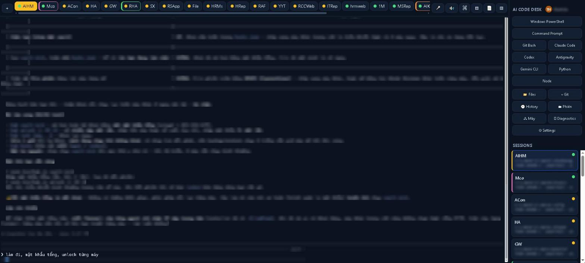
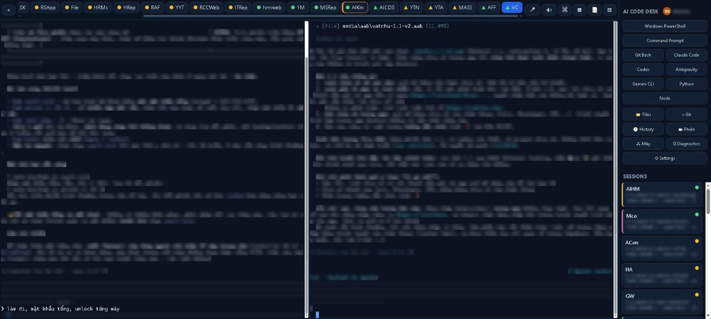
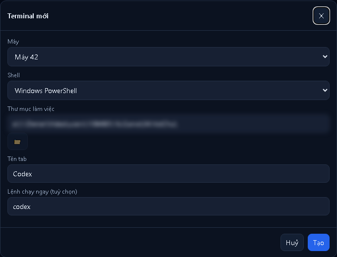
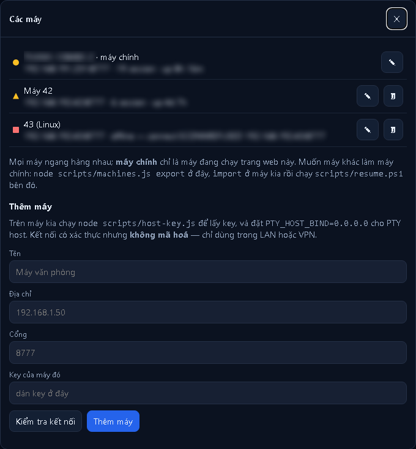
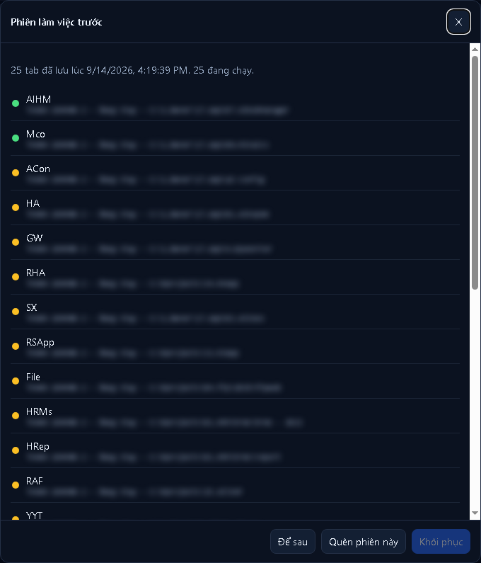
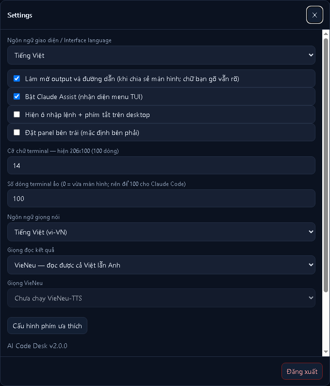
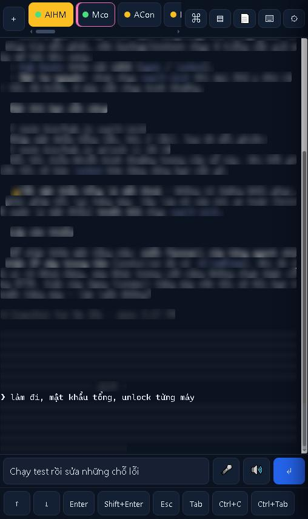
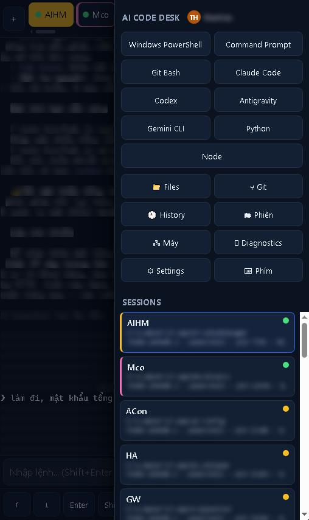

# AI Code Desk

**Chạy Claude Code, Codex, Antigravity, Gemini CLI — agent lập trình nào cũng được — trên chính các máy Windows và Linux của bạn, rồi điều khiển tất cả từ một tab trình duyệt hay từ điện thoại.**

[English](README.md) · **Tiếng Việt**


<sub>Một ngày làm việc thật: 25 terminal trên hai máy. Output của terminal được làm mờ bằng chính chế độ trình chiếu của app; những gì bạn gõ vẫn đọc được.</sub>

AI Code Desk là web terminal tự host, làm ra cho các AI agent lập trình chạy dài hơi. Mỗi tab là một
pseudo-terminal thật (ConPTY trên Windows, PTY POSIX trên Linux) do một tiến trình host nhỏ nắm giữ, nên giao
diện toàn màn hình của các agent chạy y hệt trong Windows Terminal — và vẫn chạy tiếp khi bạn đóng trình duyệt,
mất sóng, hay khởi động lại web server.

```
 Trình duyệt điện thoại / máy tính bảng / PC
          │  HTTPS + đúng một WebSocket
          ▼
   Web server  (server/server.js)     ← khởi động lại lúc nào cũng được
          │  TCP + key riêng của từng máy
          ▼
   PTY host    (server/pty-host.js)   ← giữ mọi terminal; mỗi máy một cái
          ├─ PowerShell · pwsh · cmd · Git Bash · bash · zsh
          └─ Claude Code · Codex · Antigravity · Gemini CLI · Python · git · vim …
```

---

## Mục lục

- [Vì sao](#vì-sao) · [Trông như thế nào](#trông-như-thế-nào) · [Tính năng](#tính-năng) · [Các agent được hỗ trợ](#các-agent-được-hỗ-trợ)
- [Hướng dẫn từng bước: từ cài đặt tới điện thoại](#hướng-dẫn-từng-bước-từ-cài-đặt-tới-điện-thoại)
- [Sao không dùng luôn Claude Remote Control?](#sao-không-dùng-luôn-claude-remote-control)
- [Giữ cho nó chạy](#giữ-cho-nó-chạy-windows) · [Nhiều máy](#nhiều-máy) · [Cấu hình](#cấu-hình)
- [Bảo mật](#bảo-mật) · [Phát triển](#phát-triển) · [Giới hạn đã biết](#giới-hạn-đã-biết) · [Đóng góp](#đóng-góp) · [Giấy phép](#giấy-phép)

## Vì sao

Agent lập trình có ích nhất khi được để chạy trên chính cái máy có code, có công cụ và có quyền truy cập của
bạn — thường là nhiều agent, trên nhiều dự án, ở hơn một máy. Rời bàn làm việc không nên đồng nghĩa với bỏ
chúng lại. Những cách quen thuộc để theo dõi đều hụt:

- **App RDP / SSH trên điện thoại** thì chật, và bàn phím ảo đánh nhau với mọi chương trình toàn màn hình.
- **Phần lớn web terminal** chạy lệnh bằng `exec()`, hoặc vỡ khi chương trình vẽ lại màn hình — thứ mà giao
  diện của một agent làm nhiều lần mỗi giây.
- **Tính năng điều khiển từ xa của mỗi hãng chỉ lo agent của hãng đó**, từng phiên một, qua dịch vụ của họ.
- **Bàn phím điện thoại soạn chữ qua IME** (Telex, VNI, gõ dấu tự động …), và một terminal gửi từng ký tự một
  sẽ biến nó thành chữ vỡ.

AI Code Desk được làm ra theo đúng một khối việc thật — hàng chục phiên agent trên các máy Windows và Linux,
được theo dõi và điều khiển từ iPhone — và mọi quyết định thiết kế dưới đây đều bắt nguồn từ một thứ từng hỏng
trong hoàn cảnh đó.

## Trông như thế nào

| | |
|---|---|
|  |  |
| **Mọi dự án, một màn hình.** Mỗi dự án một tab; hình là máy (● máy này, ▲ máy kia), màu là trạng thái (xanh: agent đã làm việc ở đây, vàng: shell). Nút bấm mở từng agent đã cài. | **Hai máy, cạnh nhau.** Chia đôi màn hình: agent ở máy này bên trái, agent ở máy 42 bên phải. |
|  |  |
| **Mở agent nào, ở máy nào cũng được.** Chọn máy, shell, thư mục và lệnh chạy ngay — ở đây là `codex`. | **Mọi máy ngang hàng.** Mỗi máy có tên và hình riêng; máy đang phục vụ trang web chỉ đơn giản là "máy chính". |
|  |  |
| **Bật lại sau khi tắt máy.** Mọi tab bạn đang mở, đúng thư mục, đúng máy, chỉ một cú bấm. | **Settings.** Ngôn ngữ giao diện, làm mờ khi trình chiếu, số dòng ảo, giọng nói. |
|  |  |
| **Trên điện thoại.** Ô nhập lệnh gõ được tiếng Việt, hàng phím cho những phím điện thoại không có. | **Mọi agent chỉ một chạm,** từ menu bên của điện thoại. |

## Tính năng

### Terminal thật, và không chết

- **node-pty trên ConPTY / PTY POSIX**, không phải `exec()`. Chạy được trong terminal thì chạy được ở đây.
- **Terminal nằm trong một PTY host riêng.** Đóng tab, mất mạng, deploy lại web server: session vẫn chạy, và khi
  kết nối lại thì scrollback được phát lại (512 KB mỗi session, phát lại đúng khổ lúc ghi, nên không có dòng
  nào xuống dòng sai).
- **Lịch sử session.** Mở lại bất kỳ terminal nào đã đóng, đúng shell, đúng thư mục.
- **Khôi phục phiên làm việc.** Sau khi khởi động lại máy hay mất điện, đặt lại mọi tab — đúng thứ tự, đúng thư
  mục, đúng máy — bằng một cú bấm.

### Làm cho agent lập trình

- **Nút mở một chạm** cho Claude Code, Codex, Antigravity và Gemini CLI — mỗi nút chỉ hiện ở máy có cài agent
  đó. Gõ lệnh trong tab nào cũng được như nhau.
- **Số dòng ảo.** PTY được khai một màn hình cao hơn điện thoại (mặc định 100 dòng), nên agent vẽ lại câu trả
  lời dài ngay tại chỗ thay vì in lại những bản sao vỡ vào scrollback.
- **Bản ghi hội thoại đọc được** ngay trong thư mục dự án (`.claudehis.txt`, `.codexhis.txt`, `.agyhis.txt`,
  `.geminihis.txt`): chính xác những gì bạn gõ, và những gì agent hiển thị — dựng lại bằng một bộ mô phỏng màn
  hình VT ghi từng dòng ngay trước khi nó bị vẽ đè, chứ không phải bóc mã escape.
- **Claude Assist.** Khi agent bắt bạn chọn một mục, các lựa chọn hiện thành nút thật. Nó chỉ tự gửi phím khi
  biết chắc mục nào đang được chọn; không chắc thì đưa bạn phím mũi tên/Enter/Esc thay vì đoán.
- **Chế độ đọc gọn** (📄) liệt kê một phiên Claude Code thành từng bước: bạn hỏi gì, nó chạy gì, nó nói gì.

### Ưu tiên điện thoại

- Giao diện thiết kế riêng cho điện thoại, không phải bản desktop thu nhỏ.
- **Ô nhập lệnh an toàn với IME.** Telex/VNI, Gboard và bàn phím iOS soạn chữ đúng; phím Enter bấm lúc IME đang
  soạn là của IME. Tin nhắn nhiều dòng tới agent đi thành một tin.
- **Cuộn bằng tay có quán tính**, chạy được cả khi chương trình đã chiếm chuột.
- **Bàn phím chỉ mở khi bạn chạm vào ô nhập.** Chạm vào terminal là để đọc. Chạm đúng dòng con trỏ (hoặc chạm
  đúp) để gõ thẳng vào chương trình.
- **Điện thoại không làm méo terminal trên desktop** chỉ vì bạn nhìn nó — chỉ khi bạn gõ.
- **Giọng nói.** Đọc chính tả vào ô lệnh; nghe đọc to câu trả lời cuối, đã bỏ phần suy luận và lệnh công cụ.

### Nhiều máy, một màn hình

- Thêm máy Windows hoặc Linux khác bằng địa chỉ và key; máy đó chỉ cần chạy PTY host.
- **Mọi máy là một dòng ngang hàng trong cùng một danh sách.** Xuất ra, nhập ở máy khác, và máy đó thành máy
  phục vụ giao diện — cùng id, cùng tên, cùng các tab đã lưu.

### Tiện ích hằng ngày

- **Hai ngôn ngữ giao diện**, tiếng Việt và tiếng Anh: tự theo ngôn ngữ trình duyệt, đổi được trong Settings.
- **Chế độ trình chiếu** làm mờ output terminal, đường dẫn và tên tài khoản, còn những gì bạn gõ vẫn đọc được —
  để chia sẻ màn hình, livestream, hay chụp ảnh như những tấm ở trên. `?view` mở một cửa sổ chỉ xem, không bao
  giờ đổi kích thước terminal của ai.
- Tên tab đi theo thư mục làm việc, ghim được tên, 9 màu, kéo thả để sắp xếp.
- Chia đôi màn hình, command palette (`Ctrl+K`), `Alt+1..9`, trình quản lý file trong những thư mục bạn cho
  phép, xem git chỉ đọc, bảng chẩn đoán, và tài khoản có phân vai admin/user — mỗi tài khoản chỉ thấy terminal
  của mình.

## Các agent được hỗ trợ

| Agent | Lệnh | Nút một chạm | File bản ghi | Tab chuyển xanh |
|---|---|---|---|---|
| Claude Code | `claude` | luôn có | `.claudehis.txt` | ✓ |
| Codex | `codex` | khi `codex` có trong PATH | `.codexhis.txt` | ✓ |
| Antigravity | `agy` hoặc `antigravity` | khi đã cài | `.agyhis.txt` | ✓ |
| Gemini CLI | `gemini` | khi `gemini` có trong PATH | `.geminihis.txt` | ✓ |
| Mọi thứ khác (aider, opencode, một REPL …) | gõ tên nó | — | — | giữ màu vàng |

Mỗi agent chạy trong một terminal thật y như bạn tự gõ tên nó, nên không gì ở đây phụ thuộc vào cách agent
làm việc bên trong, và một agent mới ra hôm nay là dùng được ngay hôm nay. Claude Code là agent được dùng hằng
ngày trên các máy làm ra dự án này; các agent khác đi qua đúng bộ máy terminal, nút mở và bản ghi đó. Claude
Assist được làm quanh các câu hỏi của Claude Code; menu đánh số và câu hỏi có/không của agent khác được đọc bằng
cùng các quy tắc, và thứ gì nó không chắc thì trả về hàng phím.

**Riêng Claude Code:** gõ `claude` không kèm gì sẽ chạy thành
`claude --remote-control "<tên tab>" --name "<tên tab>"`, nên phiên Remote Control của Claude mang đúng tên tab
của bạn. Có bất kỳ tham số nào thì `claude` chạy nguyên như bạn gõ.

---

## Hướng dẫn từng bước: từ cài đặt tới điện thoại

Mục tiêu: các agent làm việc trên nhiều dự án, ở hơn một máy, và bạn điều khiển chúng từ điện thoại qua một địa
chỉ tạm — không mở cổng trên router, không cài app VPN, không cần tài khoản của hãng nào.

### 1. Cài lên máy có code của bạn

Windows, trong một PowerShell **quyền Administrator** (trình cài đặt lưu cấu hình ở mức toàn máy):

```powershell
git clone https://github.com/minaico/ai-code-desk.git ai-code-desk
cd ai-code-desk
.\scripts\install.ps1 -Password "mat-khau-that-dai" -Roots "C:\Users\ban\du-an"
.\scripts\resume.ps1
```

- `install.ps1` chạy `npm install`, build giao diện, và lưu **hash scrypt** của mật khẩu — không bao giờ lưu
  chính mật khẩu — vào `WEB_TERMINAL_PASSWORD_HASH`. `-Roots` là nơi trình quản lý file được đi tới (terminal
  thì vẫn mở được ở mọi nơi trừ thư mục hệ thống Windows).
- `resume.ps1` khởi động PTY host và web server **tách khỏi cửa sổ**, nên đóng cửa sổ thì chúng vẫn chạy. Nó chỉ
  khởi động thứ chưa chạy, nên đây cũng là cách bật lại mọi thứ sau khi khởi động lại máy.

Linux:

```bash
git clone https://github.com/minaico/ai-code-desk.git ai-code-desk && cd ai-code-desk
npm ci && npm run build
export WEB_TERMINAL_PASSWORD_HASH="$(node scripts/hash-password.js 'mat-khau-that-dai')"
npm start          # web server ở :9777; tự khởi động PTY host
```

Yêu cầu: Node.js 20 trở lên (phát triển trên 24; bộ test cần 22+). `node-pty` có sẵn bản dựng cho Windows và
macOS; trên Linux phải biên dịch (`sudo apt install -y build-essential python3`). macOS chưa kiểm thử.

> Không đặt mật khẩu thì server dùng **`123123`** và cảnh báo rõ. Đổi nó trước khi cổng mở tới bất kỳ nơi nào
> bạn không tin tưởng. Nhiều người dùng thì tạo tài khoản: `node scripts\user.js add alice --admin` in ra mật
> khẩu tạm, bắt buộc đổi ở lần đăng nhập đầu.

### 2. Mỗi dự án một tab, rồi mở agent

Mở `http://<ip-của-máy>:9777` rồi đăng nhập. Với mỗi dự án:

1. Bấm **＋** (hoặc `Ctrl+K`), chọn thư mục, và điền lệnh của agent vào *Lệnh chạy ngay* — `claude`, `codex`,
   `agy`, `gemini`. Hoặc bấm nút của agent ở panel bên rồi `cd` vào dự án.
2. Đặt tên tab (hoặc để nó lấy tên thư mục) và chọn màu.
3. Nói chuyện với agent như bình thường. Chấm của tab chuyển xanh khi agent đã làm việc ở đó, và bản ghi hội
   thoại dần hình thành trong thư mục dự án.

Danh sách tab được lưu liên tục. Sau khi khởi động lại máy, chạy `resume.ps1` rồi bấm **Phiên → Khôi phục**.

### 3. Thêm các máy khác (tuỳ chọn)

Trên mỗi máy khác, chỉ chạy PTY host; script in ra địa chỉ và key của máy:

```powershell
.\scripts\start-remote-host.ps1 -AllowFirewall -FromSubnet 192.168.1.0/24   # Windows, quyền Administrator
```
```bash
./scripts/start-remote-host.sh                                              # Linux
```

Quay lại giao diện: **Máy → Thêm máy** — tên, địa chỉ, cổng `8777`, key. Từ đó hộp thoại *Terminal mới* có ô
chọn máy, và mọi phím gõ, đổi kích thước, khởi động lại đều đi tới đúng máy đang giữ terminal. Liên kết giữa
các máy được **mã hoá bằng TLS-PSK** lấy khoá từ chính `.data/host.key` của máy đó — không cần chứng chỉ nào.
Key sai rớt ngay ở bước bắt tay TLS. Dù vậy vẫn nên giữ trong LAN hoặc VPN (WireGuard, Tailscale, ZeroTier …).

### 4. Vào từ điện thoại bằng một địa chỉ tạm

Trên máy phục vụ giao diện, đã cài [`cloudflared`](https://developers.cloudflare.com/cloudflare-one/connections/connect-networks/downloads/)
(`winget install Cloudflare.cloudflared`):

```powershell
.\scripts\start-cloudflare-test.ps1
```

Script kiểm tra server còn khoẻ, mở một **Cloudflare Quick Tunnel** và in ra địa chỉ dạng
`https://vai-tu-ngau-nhien.trycloudflare.com`. Mở nó trên điện thoại, đăng nhập, và thêm vào màn hình chính.
Không cần tài khoản Cloudflare, không mở gì trên router, WebSocket chạy qua WSS trên cùng địa chỉ. Script từ
chối chạy khi chưa đặt mật khẩu, vì địa chỉ đó ai cũng vào được.

Địa chỉ đổi mỗi lần tunnel khởi động lại. Muốn một địa chỉ cố định, dùng tunnel có tên và đặt **Cloudflare
Access** phía trước, để có thêm một lớp đăng nhập trước cả khi ai đó thấy trang đăng nhập:

```powershell
cloudflared tunnel login
cloudflared tunnel create ai-code-desk
```
```yaml
# ~/.cloudflared/config.yml
tunnel: ai-code-desk
credentials-file: C:\Users\<ban>\.cloudflared\<tunnel-id>.json
ingress:
  - hostname: code.example.com
    service: http://127.0.0.1:9777
  - service: http_status:404
```
```powershell
cloudflared tunnel route dns ai-code-desk code.example.com
cloudflared service install
```

Sau đó thêm một ứng dụng Access cho `code.example.com` trong Cloudflare Zero Trust.

### 5. Làm việc từ điện thoại

- **Chuyển dự án** bằng thanh tab; hình trên tab cho biết bạn sắp gõ vào máy nào.
- **Gõ vào ô nhập lệnh** ở dưới — gõ tiếng Việt thoải mái — rồi bấm ↵. Nó tới agent thành một tin. Hàng phím có
  ↑ ↓ Enter Esc Tab Ctrl+C cho menu và ngắt lệnh.
- **Khi agent xin quyền**, Claude Assist hiện các lựa chọn thành nút.
- **Mở agent mới** từ menu ⚙: đúng các nút như trên desktop, trên máy nào cũng được.
- **Đọc chứ không làm méo.** Nhìn một terminal từ điện thoại không đổi khổ của nó trên desktop; chỉ khi bạn gõ.
  Vuốt để cuộn, kể cả bên trong một agent toàn màn hình.
- **Nghe thay vì đọc:** 🔊 đọc to câu trả lời cuối.

### 6. Cho người khác xem

Settings → **Làm mờ output và đường dẫn**, hoặc mở trang kèm `?blur`: output terminal, đường dẫn thư mục và tên
tài khoản bị làm mờ, những gì bạn gõ vẫn đọc được. Thêm `?view` cho một cửa sổ (máy chiếu, màn hình phụ) không
bao giờ đổi kích thước terminal của ai. Mọi ảnh trên trang này đều chụp theo cách đó.

---

## Sao không dùng luôn Claude Remote Control?

Remote Control của Claude Code cho bạn tiếp tục một cuộc hội thoại Claude Code từ claude.ai hay app Claude, và
làm việc đó tốt. AI Code Desk trả lời một câu hỏi khác — *mọi terminal của tôi, ở mọi nơi*:

| | Claude Remote Control | AI Code Desk |
|---|---|---|
| Agent | Claude Code | Claude Code, Codex, Antigravity, Gemini CLI, mọi CLI, cả shell thường |
| Bạn thấy gì | cuộc hội thoại | terminal thật: giao diện của chính agent, menu của nó, output của nó |
| Phiên | từng phiên Claude đã bật nó, mỗi trang một cuộc hội thoại | mọi tab trên mọi máy, cạnh nhau, trong một trang |
| Ngoài agent | — | shell ngay bên cạnh: chạy test, xem git, khởi động lại server |
| Đi qua | dịch vụ của Anthropic | server của chính bạn, cùng một tunnel bạn chọn |
| Sau khi khởi động lại máy | mở lại từng phiên | khôi phục mọi tab ở đúng thư mục |

Hai thứ không loại trừ nhau: gõ `claude` không kèm gì trong AI Code Desk cũng bật luôn Remote Control, đặt tên
theo tab, nên cái nào tiện thì dùng cái đó.

---

## Giữ cho nó chạy (Windows)

| Việc | Lệnh |
|---|---|
| **Bật lên, hoặc bật lại sau khi khởi động lại máy** | `.\scripts\resume.ps1` (hoặc bấm đúp `scripts\resume.bat`) |
| Khởi động lại tất cả (đóng mọi terminal) | `.\scripts\resume.ps1 -Restart` |
| Chỉ dừng web server, giữ terminal | `.\scripts\stop.ps1 -WebOnly` |
| Xem tình trạng | `.\scripts\status.ps1` |
| Tự chạy khi bật máy (admin) | `.\scripts\install-service.ps1` — hai Scheduled Task, tự khởi động lại |
| Gỡ phần tự chạy / gỡ toàn bộ | `.\scripts\uninstall-service.ps1` · `.\scripts\uninstall.ps1 -PurgeData -PurgeModules` |

Scheduled Task chạy dưới chính tài khoản của bạn (đăng nhập kiểu S4U, không lưu mật khẩu Windows), nên các
agent, npm và `PATH` hoạt động như lúc bạn đang đăng nhập. Dùng NSSM cũng được — xem
[hướng dẫn chi tiết](docs/huong-dan-chi-tiet.md#windows-service--autostart).

## Nhiều máy

Mọi máy, kể cả máy đang phục vụ giao diện, là một dòng trong `.data/hosts.json`. Không chỗ nào ghi máy nào là
"chính": lúc khởi động, web server tự tìm mình trong danh sách bằng id đọc từ hệ điều hành (`MachineGuid` trên
Windows, `/etc/machine-id` trên Linux) — thứ mà một file chép sang không mang theo được. Nên cùng một danh sách
đọc ở máy nào cũng đúng, và chuyển vai máy chính chỉ là chép file:

```powershell
# trên máy chính hiện tại
node scripts\machines.js export D:\chuyen\group.json
# trên máy sẽ làm máy chính (đã pull code và build, web server bên đó chưa chạy)
node scripts\machines.js import D:\chuyen\group.json
.\scripts\resume.ps1
```

File export mang theo danh sách máy, các tài khoản và các tab đã lưu, và **chứa key của mọi máy** — chép qua
đường tin cậy rồi xoá đi. `resume.ps1` cho PTY host nghe trên LAN khi danh sách có máy khác, và in sẵn rule
firewall giới hạn đúng những máy đó.

## Cấu hình

Biến môi trường (danh sách đầy đủ ở [hướng dẫn chi tiết](docs/huong-dan-chi-tiet.md#cấu-hình-biến-môi-trường)):

| Biến | Mặc định | Ý nghĩa |
|---|---|---|
| `PORT` / `HOST` | `9777` / `0.0.0.0` | web server |
| `PTY_HOST_PORT` / `PTY_HOST_BIND` | `8777` / `127.0.0.1` | PTY host; bind `0.0.0.0` để máy khác tới được |
| `PTY_HOST_TLS` | `1` | mã hoá kênh giữa các máy bằng TLS-PSK; đặt `0` chỉ khi cần nói với máy chạy bản cũ |
| `WEB_TERMINAL_PASSWORD_HASH` | — | hash scrypt từ `node scripts/hash-password.js` (khuyến nghị) |
| `WEB_TERMINAL_PASSWORD` | `123123` | mật khẩu thô; chuỗi rỗng là tắt xác thực (chỉ cho localhost!) |
| `WEB_TERMINAL_ROOTS` | thư mục profile của bạn | thư mục trình quản lý file được dùng, ngăn bằng `;` (`:` trên Linux) |
| `WEB_TERMINAL_DATA` | `./.data` | key, lịch sử, log |
| `WEB_TERMINAL_SCROLLBACK_KB` | `512` | scrollback giữ mỗi terminal |
| `WEB_TERMINAL_MAX_SESSIONS` | `0` (không giới hạn) | trần số terminal chạy cùng lúc trên mỗi máy, nếu muốn đặt |
| `WEB_TERMINAL_TOKEN_HOURS` | `168` | một lần đăng nhập giữ được bao lâu |
| `WEB_TERMINAL_TLS_CERT` / `_KEY` | — | phục vụ HTTPS trực tiếp (tối thiểu TLS 1.2) |
| `WEB_TERMINAL_HSTS_DAYS` | `0` (tắt) | gửi Strict-Transport-Security, khi app đã ở một tên miền của bạn |
| `WEB_TERMINAL_ADDRESS` | tự tìm | địa chỉ các máy khác dùng để tới máy này |
| `CLAUDE_BIN` | tự dò | đường dẫn tới `claude` |

## Bảo mật

AI Code Desk về bản chất là thực thi lệnh từ xa: ai đăng nhập được là có shell với quyền của tài khoản đang chạy
nó. Nó được làm ra để đó là thứ *duy nhất* một người vào được có thể lấy.

- **Xác thực:** mật khẩu băm scrypt, tài khoản có phân vai, cookie HttpOnly + SameSite (`Secure` khi sau HTTPS),
  token ký HMAC, chặn theo IP với thời gian chờ tăng dần.
- **Request:** request làm thay đổi trạng thái phải có header `X-WT-Client` (form từ site khác không đặt được);
  WebSocket kiểm tra `Origin` khớp `Host` và kiểm tra token; phím gõ và đổi kích thước chỉ được nhận cho terminal
  mà kết nối đó đã attach — và là chủ. Trang không cho nhúng vào khung (`X-Frame-Options: DENY`).
- **File:** trình quản lý file bị giới hạn trong `WEB_TERMINAL_ROOTS`, kiểm tra sau khi đã phân giải symlink và
  junction; từ chối đường dẫn UNC và tên dành riêng; upload bị chặn theo cả dung lượng khai báo *lẫn* thực nhận.
- **Git:** chỉ đọc, chạy bằng `execFile` với mảng tham số — không qua shell.
- **Giữa các máy:** kênh PTY là TLS 1.2 với bộ mã PSK, khoá là `.data/host.key` của chính máy đó — **không có
  chứng chỉ nào phải tạo hay phải tin**, vì khoá mà liên kết vốn đã dùng chính là khoá mã hoá. Key sai giờ rớt
  ở bước bắt tay TLS chứ không vào tới giao thức, và kẻ đứng giữa không thể giả làm PTY host khi không có key.
  Dù vậy vẫn nên giữ trong LAN hoặc VPN.
- **Log** không bao giờ chứa mật khẩu, token, hay nội dung gõ vào / in ra từ terminal.
- **Chưa bao phủ:** đọc chính tả gửi âm thanh tới dịch vụ nhận dạng giọng nói của Apple hoặc Google thông qua
  trình duyệt.

Trước khi mở ra ngoài: đổi mật khẩu mặc định, chạy dưới một tài khoản riêng có quyền tối thiểu, đừng bao giờ đặt
`WEB_TERMINAL_ROOTS` là cả một ổ đĩa, và đặt HTTPS cùng Cloudflare Access (hoặc VPN) phía trước.

Phát hiện lỗ hổng? Xin báo riêng qua nút *Report a vulnerability* của repo này trên GitHub, đừng mở issue công khai.

## Phát triển

```powershell
npm install
npm run build      # giao diện vào dist/
npm start          # web server (tự khởi động PTY host nếu cần)
npm run host       # chỉ PTY host
npm run dev        # Vite dev server ở :5173, chuyển /api và WebSocket sang :9777
npm test           # 184 test
```

Bộ test bật **PTY host và web server thật** trên cổng ngẫu nhiên và mở terminal thật: gõ qua WebSocket và đọc
output thật của tiến trình, khởi động lại web server rồi kiểm tra session và scrollback còn nguyên, tấn công API
file bằng path traversal và tên file độc, định tuyến tới một "máy" thứ hai, chuyển vai máy chính giữa hai máy giả
lập, và báo đỏ nếu chữ tiếng Việt nào trên giao diện chưa có bản tiếng Anh.

```
server/   web server, PTY host, xác thực, file, git, lịch sử, nhiều máy, bản ghi hội thoại, proxy TTS
src/      giao diện trình duyệt (ES module thuần + xterm.js, build bằng Vite); đa ngôn ngữ ở src/lib/i18n*.js
scripts/  cài đặt, bật/tắt/bật lại, tự chạy khi khởi động, máy phụ, tài khoản, nhóm máy
test/     bộ test node:test
docs/     hướng dẫn chi tiết (tiếng Việt), ảnh chụp, kịch bản demo
```

## Giới hạn đã biết

- **Khởi động lại máy là mất mọi terminal.** ConPTY không có cơ chế lưu/khôi phục tiến trình. Khôi phục phiên làm
  việc mở lại các tab ở đúng thư mục; phần lớn agent nối lại được cuộc hội thoại (`claude --continue`,
  `codex resume`).
- **Máy chạy bản cũ hơn bản này** chỉ nói được giao thức thô: đánh dấu máy đó bằng
  `node scripts/machines.js tls <máy> off` cho tới khi nâng cấp nó (xem [Bảo mật](#bảo-mật)).
- **Windows PowerShell 5.1 + emoji:** PSReadLine ném `EncoderFallbackException` khi bạn gõ emoji (lệnh vẫn chạy).
  PowerShell 7 (`pwsh`) không bị. Tiếng Việt không bị ảnh hưởng.
- **`Ctrl+Tab`** bị Chrome và Edge giữ; dùng `Alt+1..9`, `Ctrl+PageUp/PageDown` hoặc phím trên màn hình.
- Bộ chọn thư mục và trình quản lý file chạy trên máy đang phục vụ giao diện; với máy khác thì gõ đường dẫn.
- Chia đôi màn hình cố định 50/50. Bản ghi hội thoại là bản đã làm sạch của màn hình, không phải log cấp giao thức.

## Tài liệu

- [Hướng dẫn chi tiết](docs/huong-dan-chi-tiet.md) — mọi script và biến môi trường, API HTTP và WebSocket, hành
  vi trên điện thoại, giọng nói, mô hình bảo mật, xử lý sự cố.
- [Kịch bản demo](docs/demo-script.md) — ảnh và GIF trên trang này được làm ra như thế nào.

## Đóng góp

Rất hoan nghênh issue và pull request. Những thứ có ích nhất lúc này:

1. Thêm ngôn ngữ giao diện (thêm một từ điển cạnh `src/lib/i18n-en.js`).
2. Kiểm thử trên macOS, và với nhiều agent hơn.
3. Mã hoá liên kết giữa các máy.

Hãy chạy `npm test` trước khi mở pull request, và viết commit message giải thích *vì sao* cần thay đổi — diff đã
cho thấy thay đổi những gì.

## Giấy phép

[MIT](LICENSE) © 2026 Minaico

AI Code Desk là dự án độc lập, không liên kết, không được bảo trợ hay tài trợ bởi Anthropic, OpenAI hay Google.
Claude và Claude Code là nhãn hiệu của Anthropic, PBC; Codex là nhãn hiệu của OpenAI; Gemini và Antigravity là
nhãn hiệu của Google LLC.
